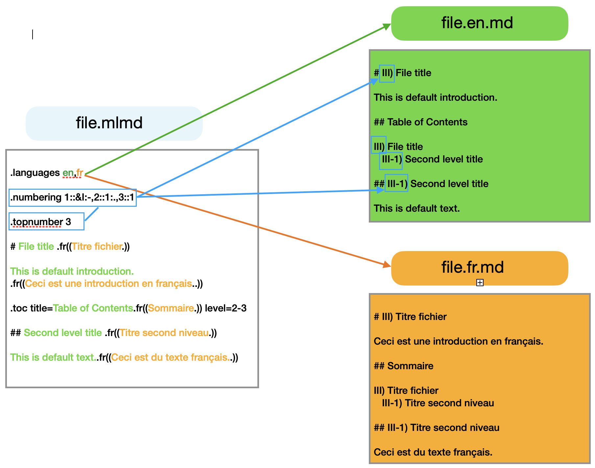

# MLMD - Générateur de Markdown Multilingue<A id="a1"></A>

 : [README](README.md), [Documentation](docs/MLMD.md)<br />
 : [README](README.fr.md), [Documentation](docs/MLMD.fr.md)<br />

MLMD génère un ou plusieurs fichiers Markdown dans plusieurs langues à partir d'un ou
plusieurs fichiers sources encodés en UTF-8, guidé par des directives dans le texte qui 
délimitent les parties propres à chaque langue.

Les drapeaux de pays dans cette documentaztion sont gracieusemenbt fournis par le site https://www.drapeauxdespays.fr.

## Comment ?<A id="a2"></A>

MLMD est un script PHP. It reçoit en paramètre une liste de fichiers et quelques
réglages, analyse les fichiers et génère les fichiers Markdown pour chaque langue.

MLMD nécessite l'interpréteur PHP version 7 ou ultérieure.

## Quoi ?<A id="a3"></A>

Un fichier source MLMD est un fichier texte encodé en UTF-8 qui utilise l'extension `.mlmd`.
L'extension `.base.md` est également acceptée.

MLMD traite chaque fichier source pour chaque langue déclarée, et génère les fichiers
Markdown pour chaque fichier dans chaque langue : *`fichier.mlmd`* générera *`fichier.fr.md`*,
*`fichier.en.md`* et ainsi de suite.

Les langues doivent être déclarées dans au moins un des fichiers sources, qui sont examinées
lors d'un prétraitement avant que démarre la génération des fichiers proprement dite. Les parties de
texte dans chaque langue sont entourées de directives de début et de fin, tandis que d'autres
directives génèrent un sommaire, numérotent les titres, ajoutent des fichiers au traitement
ou effectuent diverses autres tâches.



## Quelle rapidité ?<A id="a4"></A>

Ecrire des parties dans une langue est rapide et facile. Le texte par défaut qui est
généralement dans la langue de l'auteur original du texte n'a pas besoin de directives
particulières, tandis que les parties dans d'autres langues sont entourées de
simples directives d'ouverture et de fermeture. Par exemple, pour du texte en français on
écrit la directive d'ouverture `.fr((`, suivie du texte en français, que l'on termine par `.))`. Les
lignes vides, barrières de bloc de code, les tableaux et toutes les fonctionnalités Markdown
peuvent être utilisés entre les deux marqueurs. Les titres commençant par `#` peuvent également
contenir des parties dans différentes langues, ou être entourés par les directives comme le texte normal.

L'exemple suivant montre comment écrire un titre multilingue :

```code
# Example of a multilingual title.fr((Exemple de titre multilingue.))
.((# Default title.))
.fr((# Titre en français.))
```

Concernant la vitesse de traitement, le script MLMD traite les 2000 lignes de sa propre
documentation en environ 2 secondes sur un Intel i7 à 2GHz, les fichiers étant générés sur SSD.

## Pourquoi ?<A id="a5"></A>

J'ai conçu MLMD pour mes besoins alors que je devais rédiger une documentation technique
en Anglais et en Français pour un projet de kit électronique. En cherchant sur le Web j'ai rapidement
trouvé un [script Python très efficace de Hong-ryul Jong](https://github.com/ryul1206/multilingual-markdown).
Toutefois après un peu d'utilisation il me manquait des fonctionnalités et je souhaitais des directives
qui conserveraient une meilleure lisibilité du texte et plus faciles à saisir que les tags de
commentaire HTML. J'ai conservé la plupart des idées de départ de Hong-ryul Jong comme le texte
ignoré et la déclaration des langues mais j'ai retravaillé le design pour que les directives
puissent être insérées dans le texte et n'utilisent pas la syntaxe des commentaires HTML. J'ai aussi
implémenté différents modes de sortie pour pouvoir travailler dans des contextes HTML ou Markdown pur.

MLMD permet à l'utilisateur de rédiger du texte par défaut lorsqu'une traduction n'est
pas encore disponible, de choisir des schémas complexes de numérotation des titres globalement
ou dans chaque fichier, d'inclure d'autres fichiers au traitement, d'échapper du texte, 
d'utiliser quelques variables pour créer des liens indépendants de la langue, et bien d'autres 
tâches.

Des fonctionnalités spéciales permettent de séparer les parties des différentes langues
dans des paragraphes distincts ou de les enchaîner au choix du rédacteur ou de la rédactrice.

Ecrire des fichiers sources MLMD est presque aussi simple que rédiger des fichiers Markdown.
MLMD se conforme à UTF-8 par nature et acceptera tous les jeux de caractères de toutes les
langues au sein des fichiers source.

MLMD est un moyen pratique pour conserver la structure d'une documentation tout en
permettant sa traduction progressive par différents auteurs et autrices. En tant que fichiers textes,
les sources multilingues MLMD se manipulent parfaitement avec les outils de gestion de version
comme Git, permettant les comparaisons, les pull-requests et la fusion de fichiers.

## Documentation<A id="a6"></A>

Une [documentation complète](docs/MLMD.fr.md) de MLMD est disponible dans le répertoire `docs`.

Le [fichier source de ce README](README.mlmd) se trouve dans le fichier `README.mlmd`.

- La [source de la documentation complète](docsource/MLMD.mlmd) est rédigée en MLMD elle-même
et se trouve dans le répertoire `docsource`. Elle constitue un exemple exhaustif des styles d'écriture
des sources MLMD et de l'utilisation des différentes directives et montre comment inclure
d'autres fichiers sources dans une documentation.

### Construction de la documentation complète<A id="a7"></A>

La documentation MLMD est construite avec la commande suivante :

```code
php src/mlmd.php  -i docsource/MLMD.mlmd -out md -od docs
```

- Le paramètre `-i` indique à MLMD où trouver le fichier source, qui inclue à son tour d'autres fichiers sources
MLMD lors de son traitement.
- Le paramètre `-out` règle le mode de sortie mixte Markdown/HTML pour les liens et les sommaires.
- Le paramètre `-od` indique un répertoire où écrire les fichiers générés. Les chemins indiqués dans cette commande
sont relatifs au répertoire d'où MLMD a été démarré, mais on peut utiliser des chemins absolus.

### Construction du README<A id="a8"></A>

Le document README que vous lisez actuellement est construit par la commande suivante :

```code
php src/mlmd.php -i README.mlmd -out md
```

## Amusez-vous !<A id="a9"></A>

J'espère que MLMD vous aidera à maintenir facilement vos documentations multilingues.

En ces jours de Covid, prenez soin de vous et des autres

Francis Piérot

Août-Décembre 2020<br />
A mon papa Serge, 1932-2020<br />
Il m'a appris qu'un ingénieur travaille dur à travailler moins.

 : [README](README.md), [Documentation](docs/MLMD.md)<br />
 : [README](README.fr.md), [Documentation](docs/MLMD.fr.md)<br />
