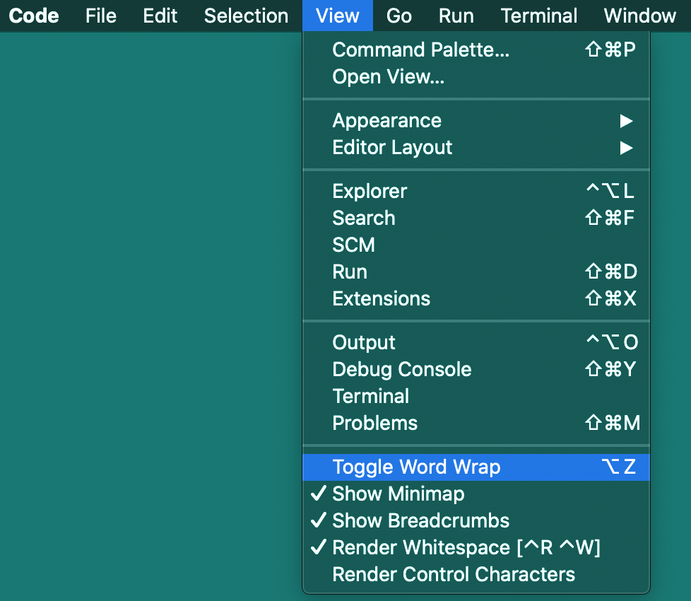

# III) Rédaction des fichiers sources<A id="a22"></A>

Les fichiers source doivent posséder une extension `.base.md` ou `.mlmd`. Leur contenu
est du texte encodé en UTF-8 avec des fins de ligne Windows ou Linux/macOS. MLMD est
conforme à UTF-8, aussi un encodage Windows ou macOS aurait des effets erratiques, les 
codes de caractère entre 128 et 255 étant invalides en UTF-8. Les fichiers source doivent
impérativement utiliser l'encodage UTF-8 pour tout caractère hors de l'ASCII (codes 0 à 127).

L'utilisateur contrôle les langages qu'il souhaite utiliser dans les fichiers source.
Chaque langage est déclaré avec un code choisi par l'utilisateur. L'utilisation de
codes ISO standards comme `en-US` ou `fr-FR` facilite la rédaction de liens avec des API
Web pour les nations, les drapeaux et d'autres contenus internationaux mais des codes
plus simples comme `en` ou `fr` sont plus faciles et rapides à rédiger et peuvent être
associés à un code ISO. Le code du langage et le code ISO peuvent tous deux être référencés
dans le texte source à l'aide de variables détaillées plus loin dans ce document. Cherchez
`ISO 639` sur le Web pour savoir quels codes seraient appropriés selon vos besoins, car
il existe plusieurs versions du standard.

Voir [Directive `.language`]())) pour la syntaxe de la déclaration des langues.

## III-1) Début de fichier source<A id="a23"></A>

MLMD ne génère aucun texte dans aucun fichier tant qu'il n'a pas rencontré au moins une directive
`.languages` déclarant les codes de langue utilisés. C'est une contrainte globale à l'ensemble
des fichiers passés en paramètre ou présents dans le répertoire du fichier principal et
ses sous-répertoires. Une bonne pratique est de placer la directive `.languages` au début du
fichier principal. Si la directive survient loin dans un fichier, tout ce qui la précède
est ignoré, aussi lorsque les fichiers générés paraissent étranges ou s'il manque une grosse
partie de texte, la première chose à vérifier est l'emplacement de la directive `.languages`.

Pour éviter les ambigüités on peut placer la même directive `.languages` au début de chacun
des fichiers sources traités mais ce n'est pas obligatoire

- Tout texte précédant la première directive `.languages` est ignoré et ne sera générés
  dans aucun fichier.- La directive `.languages` doit être placée au début d'une ligne isolée sans aucun
  autre contenu que ses propres paramètres.- Les conventions Markdown interdisent tout contenu avant le titre de niveau 1 qui est
  considéré comme le titre du fichier, mais MLMD ignore cela et génère tout texte précédant
  le premier titre, à condition qu'il se situe après la première directive `.languages`.- Les directives facultatives `.numbering` et `.topnumber` peuvent se situer entre
  la directive `.languages` et le titre de niveau 1 `#`. Le `.numbering` sera ignoré si
  un paramètre `-numbering` a été fourni à la ligne de commande.

## III-2) Inclusion de fichiers<A id="a24"></A>

Tout fichier indiqué dans un paramètre `-i` de la ligne de commande ou résultant
de l'exploration du répertoire de démarrage peut ajouter d'autres fichiers à la liste de ceux
traités. L'inclusion n'insère pas réellement le texte d'un autre fichier à un endroit
d'un autre fichier mais l'ajoute à l'ensemble des fichiers sources.

Cette fonction permet à un fichier principal de référencer des fichiers dans lesquels
se trouvent les différentes parties de la documentation tout en conservant un fichier principal
simple et propre avec un sommaire global.

### III-2.1) Directive d'inclusion<A id="a25"></A>

La directive `.include` est suivie d'un nom relatif de fichier qui doit être accessible
à partir du répertoire du fichier principal. Le fichier inclus n'est pas forcément relatif
à celui où se trouve la directive mais plutôt au fichier principal, par exemple indiqué par
le paramètre `-main` de la ligne de commande. Le nom suit la directive sans délimiteur
particulier ou guillemets autours de lui.

La documentation MLMD est organisée en un fichier principal `README.mlmd` avec un titre
principal et un sommaire global, qui inclut 5 autres fichiers contenant les parties de la
documentation. Ceci maintient un fichier principal clair et simple à partir duquel
le lecteur peut sauter aux diverses parties de la documentation grâce aux liens du sommaire :

```code
  .include docs/1-Installation.mlmd
  .include docs/2-Using.mlmd
  ...
```

Dans cet extrait du fichier `README.mlmd` les fichiers inclus sont dans le répertoire
`docs`situé au même niveau que le `README.mlmd`. Les titres de ces fichiers sont inclus
dans le sommaire global du fichier principal :

```code
  .toc level=1-3
```

Le sommaire global contiendra tous les titres de fichiers de niveau 1 à 3 y compris
ceux des fichiers indiqués dans les directives `.include`, bien qu'ils ne soient pas
listés dans les paramètres `-i` de la ligne de commande.

### III-2.2) Numérotation des fichiers<A id="a26"></A>

Pour contrôler la numérotation des fichiers principaux et inclus, la directive
`.topnumber` règle le numéro du titre de niveau 1 dans un fichier. Un bon moyen de l'employer 
est d'utiliser `.topnumber 0` dans le fichier principal pour supprimer la numérotation de son
titre de niveau 1, puis d'inclure une directive `.topnumber` dans chaque fichier inclus
pour indiquer l'ordre dans lequel ils doivent apparaitre dans le sommaire global.

La documentation MLMD utilise ce schéma :

- le fichier `README.mlmd` utilise `.topnumber 0` pour neutraliser la numérotation de
son titre de niveau 1 et utilise `.include docs/1-Installation.mlmd` pour inclure un fichier.
Le titre `#` est suivi d'une introduction puis d'une directive `.toc` incluant les niveaux 1 à 3
des titres :

```code
  .numbering 1::&I:-,2::1:.,3::1
  .topnumber 0
  .include docs/1-Installation.mlmd
  .include docs/2-Using.mlmd
  ...
  .toc title=Table Of Contents.fr((Sommaire.)) level=1-3
```

- les fichiers inclus comportent leur propre valeur derrière `.topnumber`, ce qui détermine
leur ordre dans le sommaire global :

```code
  .topnumber 1
  ...
```

Refer to MLMD own's documentation for a complete example of MLMD `.include` and `.topnumber` use.
La documentation de MLMD illustre l'utilisation des directivess `.include` et `.topnumber`.

## III-3) Titres<A id="a27"></A>

MLMD reconnait les symboles `#` en début de ligne comme préfixe indiquant
un niveau de titre. Il ne reconnait pas les syntaxes alternatives des niveaux 1 et 2
accessibles en soulignant les titres avec `==` ou `--` sur la ligne suivante. Ces
syntaxes peuvent être utilisées afin d'apparaitre dans les fichiers Markdown générés
mais elles ne suffiront pas pour que MLMD reconnaisse les titres et les inclue dans
le schéma de numérotation ou les sommaires.

```code
# Ce titre sera reconnu par MLMD
Celui-ci sera pas reconnu car il ne possède pas de préfixe #
============================================================
## Celui-ci sera reconnu grâce à son préfixe ##
-----------------------------------------------
```

Les préfixes `#` doivent être suivis d'au moins un espace, les éventuels suffixes `#`
n'ont pas d'effet particulier. Par convention dans un fichier Markdown on peut faire suivre
les titres d'une ligne vide, MLMD accepte même plusieurs lignes vides mais n'en écrira qu'une
dans les fichiers générés.

## III-4) Fin de ligne et fin de paragraphe<A id="a28"></A>

Par défaut, en dehors des titres et des directives spéciales qui occupent une ligne,
MLMD interprète les paragraphes des fichiers sources comme du texte par défaut qui va dans tous
les fichiers générés pour chaque langage sauf ceux qui ont une section spécifique. Les fins
de ligne et les lignes vides seront reproduites dans les fichiers générés.

Une section de texte propre à un langage peut directement suivre le texte par défaut soit sur la
même ligne, soit sur la ligne suivante. Dans ce cas particulier, la fin de ligne est ignorée
par MLMD. Cette particularité permet de séparer proprement les paragraphes de texte par défaut
et ceux des autres langues. En pratique, MLMD ignore les fins de ligne uniques quand elles séparent
juste une partie d'une langue d'une autre. Les fins de ligne doublées sont considérées comme
appartenant au texte pour la langue en cours et seront écrites dans les fichiers générés. Ceci
permet une une organisation plus claire du texte tout en respectant Markdown.

Note : les marqueurs `.langue((` et `.))` dans les exemples et le texte suivant seront détaillés
plus loin, ils ouvrent ou ferment une partie propre à une langue.

```code
Ceci est du texte par défaut qui ira dans tous les fichiers sauf le français.
.fr((Ceci est du texte qui ira dans le fichier français à la place du texte précédent..))
Ce texte ira dans tous les fichiers sauf le français..fr((Ce texte ira dans le
fichier français à la place du précédent..))
```

Par convention Markdown recommande de ne pas dépasser environ 80 caractères par ligne
toutefois MLMD n'impose pas cette contrainte. Tout le texte de toutes les langues peut
être saisis sur une seule ligne ou plusieurs et n'importe quelle largeur de ligne convient.

Voici un autre exemple :

```code
.((default text.))
.fr((texte français.))
.en((english text.))
Some other text....fr((Autre texte....))
```

MLMD interprète le bloc de trois lignes de cette façon :

1. Le bloc commence sur la première ligne avec du texte par défaut qui ira dans 
   les fichiers de toutes les langues sauf celles possédant du texte spécifique2. La fin de ligne de la première ligne est ignorée car elle est immédiatement
   suivie d'une directive de langue3. La deuxième ligne placera le texte dans le fichier de la langue française, qui
   ignorera alors le texte par défaut de la première ligne.4. La fin de ligne de la deuxième ligne est ignorée car suivie d'une ouverture de langue5. La troisième ligne place le texte dans le fichier de la langue anglaise, qui ignorera
le texte par défaut.6. La double fin de ligne après la troisième ligne termine le paragraphe et la section de
texte multilingue qui précède, retournant en mode texte par défaut

Because end-of-lines are ignored when they only separate directives, the following line is
identical to the previous example and both will generate the same text in the same files:
.fr(Etant donné que les fins de ligne entre sections de langue sont ignorées, la ligne suivante
est équivalente au bloc précédent et génèrera le même texte dans les mêmes fichiers :

```code
.((default text.)).fr((french text.)).en((english text.))
Some other text....fr((Autre texte....))
```

Comme l'illustre ce dernier exemple, les deux styles peuvent être employés dans les fichiers
sources avec un effet identique. En général, les parties importantes de texte de chaque langage
peuvent être placées dans des paragraphes séparés par une simple fin de ligne, tandis que les
petites parties de texte pourront être rédigées dans les lignes d'un même bloc.

### III-4.1) Notes<A id="a29"></A>

Bien que la syntaxe Markdown impose une limite de ligne à 80 caractères, les visualiseurs ou
éditeurs de fichiers Markdown ainsi que les browsers Internet ne se préoccupent pas de cette limite
et formatent le texte correctement. De même les éditeurs de texte modernes peuvent formater le texte
sur plusieurs ligne même en l'absence de fin de ligne. La plupart possèdent une commande de formatage
ou un paramètre pour cela dans les menus ou les dialogues de réglages afin d'insérer des fins de ligne
artificielles qui ne se trouvent pas réellement dans les fichiers. Par exemple, dans Visual Code cette
possibilité s'appelle 'soft-wrapping' et on l'active .

Bien que ce ne soit pas obligatoire, il est préférable de rester cohérent dans le style de rédaction
des paragraphes de texte pour chaque langue. Un fichier peut utiliser des lignes isolées pour l'ouverture
et la fermeture des parties de chaque langues ou les placer à l'intérieur des lignes mais on évitera
de mélanger les styles dans des parties importantes de texte, faute de quoi on ne distingue plus où
seront les vraies fins de ligne

*Lignes séparées :

  Some french text.
  
  ```

Même ligne :

Some french text.
  ```

## III-5) Texte échappé<A id="a30"></A>

Les directives et variables peuvent être neutralisées dans le texte en les entourant avec
le marqueur ouvrant `.{` et le marqueur fermant `.}`. Les directives n'auront aucun effet
sur les fichiers générés, et les variables et les directives seront écrites comme du simple texte
sans interprétation.

Exemple :

```code
The .{.)).} directive closes a language part.
```

In this exemple, the `.))` directive will be considered as simple text and not as a directive.

## III-6) Texte en citation et barrières de code<A id="a31"></A>

MLMD copie telles quelles les parties de texte entourées de guillemets et accent inversé
ainsi que les barrières de code Markdown. Dans ces parties de texte 'échappées', les variables et
directives n'auront pas d'effet et seront recopiées sans interprétation

- ` ``` ` : les barrières de code placées sur une ligne isolée entourent du texte
  où les variables et directives ne seront pas interprétées.- `"` : les guillemets autour du texte neutralisent les directives et variables, par exemple
`".))"` ne fermera pas le bloc de langue actuel.- `` ` `` : les accents inversés simples, doubles ou triples peuvent entourer du texte
échappé, par exemple `.((` ne commencera pas un bloc de texte par défaut.

> Le texte échappé d'une langue doit intégralement se trouver à l'intérieur des marqueurs
  d'ouverture et fermeture de langue, puisque ces directives ne seront pas interprétées si
  elles se trouvent à l'intérieur du texte échappé.> Les apostrophes `'` n'ont pas d'effet particulier. Ce choix a été fait dans MLMD parce que
  l'apostrophe est utilisé dans de nombreuses langues pour dans d'autres buts que pour entourer
  du texte.> Accents inversés : pour utiliser ce caractère sans générer l'effet d'échappement de texte
  ils peut être entouré de double-accent inversé et d'espaces (voir [la syntaxe Markdown pour 
  l'échappement](https://daringfireball.net/projects/markdown/syntax#autoescape) et la séquence
  complète peut être entourée des marqueurs MLmD `.{` et `.}`.

## III-7) Variables<A id="a32"></A>

MLMD connait quelques *variables*. Ces variables peuvent être placées n'importe où dans le texte,
les titres ou les liens dans les fichiers sources et prendront lors de la génération une valeur
correspondant à la langue ou au fichier généré

| Variable    | Remplacé par                                   | Exemple dans les fichiers générés |
|-------------|------------------------------------------------|-----------------------------------|
| 3-Writing.fr.md      | Nom du fichier en cours de génération          | `file.fr.md`              |
| MLMD.fr.md      | Nom du fichier principal sans extension        | `README`                  |
| .fr.md | Extension du fichier en cours de génération    | `.fr.md`                  |
| fr  | Code de langue du texte en cours de génération | `fr`                      |
| fr_FR       | Code ISO associé au code de langue en cours    | `fr_FR`                   |

La variable `{main}` sera remplacée par le chemin du fichier principal tel que défini par le paramètre
`-main` de la ligne de commande. Ceci permet de placer des liens vers ce fichier, par exemple pour retourner
au sommaire général. Tout sommaire généré par une directive `.toc` possède une ancre nommée ou
identifiée `toc`. Le style de l'ancre dépend du mode de sortie.

Toutes les variables prennent une valeur lors de la génération des fichiers, sauf `{main}` qui est
ignorée si le paramètre `-main` n'a pas été spécifié dans la ligne de commande. Si le fichier principal
n'a pas été défini le texte reste `{main}` dans les fichiers générés.

## III-8) Texte par défaut<A id="a33"></A>

MLMD accepte du texte par défaut à n'importe quel endroit des fichiers sources : dans les tires, les
liens, les tables des matières, les directives ou le corps de texte. Le texte par défaut est utilisé pour
toutes les langues qui n'ont pas de section de texte dédiée.

En dehors des blocs délimités par les directives d'ouverture et de fermeture de langue, tout texte est
considéré comme du texte par défaut. Ceci est décrit dans la directive `.default((`.

## III-9) Comment éviter les ambigüités<A id="a34"></A>

Pour éviter les effets indésirables liés aux fins de ligne ou aux listes numérotées ou non,
il y a une structure qui peut séparer dans ambigüité les blocs de texte par défaut ou spécifiques.
En premier lieu on place la directive pour ouvrir une section par défaut sur une ligne seule, suivie
du bloc de texte par défaut, puis sur une nouvelle ligne on ferme la section et on ouvre une nouvelle
pour une langue, suivie du texte pour cette langue, que l'on clot avec une nouvelle ligne. La structure
avec des directives d'ouverture et de fermeture sur des lignes isolées peut être répétée autant de fois
que nécessaire.

L'exemple suivant montre que cette structure est très lisible et ne laisse planer
aucune incertitude.

```code
.((
    - Here is some default text with special feature (indented list element)
.)).fr((
    - Voici du texte en français avec une particularité (élément de liste indenté)
.))
```

Bien que les directives d'ouverture et fermeture pour le texte par défaut soient en réalité
facultatives, cette structuration avec des directives explicites sur des lignes séparées est un
moyen simple de s'assurer que le texte généré sera celui attendu.

## III-10) Directives<A id="a35"></A>

Les actions sur les fichiers et le texte générés pour chaque langue sont indiquées dans des
*directives*  placées dans les fichiers sources. Les directives MLMD commencent toujours par un
point `.`, excepté les marqueurs d'échappement de texte - voir les explications précédentes.

Les directives sont de deux sortes :

1. Les directives immédiates sont suivies de paramètres et
   modifient certains réglages de MLMD ou génèrent du texte.
2. Les directives de texte commencent et se terminent par un 
   marqueur et entourent du texte source pour lui appliquer un effet.

Voici un résumé des directives immédiates :

- `.languages` déclare les codes de langue et ISO disponibles dans les fichiers source
- `.numbering` programme le schéma de numérotation pour les titres et les sommaires
- `.topnumber` indique le numéro du titre de niveau 1 du fichier dans le schéma de numérotation
- `.toc` génère un sommaire dans le fichier à partir des titres des niveaux indiqués
   et du schéma de numérotation

Voici un résumé des directives de texte :

- `.all((` commence une section de texte qui ira dans les fichiers de toutes les langues
- `.default((` ou `.((` commence le texte par défaut qui ira dans les fichiers des langues n'ayant pas une section spécifique.
- `.ignore((` ou `.!((` commence une section de texte qui ne sera placé dans aucun fichier généré
- `.<code>((` commence une section de texte spécifique à une langue dont le code a été spécifié dans `.languages`
- `.))` termine une section de texte ouverte par une des directives `.((` et repasse à la langue précédente
- `.{` commence une section de texte échappé (pas d'interprétation des variables et directives)
- `.}` termine une section de texte échappé

Les directives ne sont pas sensibles aux minuscules et majuscules : `.fr((` est identique 
à `.FR((`. Il faut souligner que les marqueurs d'échappement de texte fonctionnent comme des directives
mais comme ils dérivent de la syntaxe Markdown ils seront présents dans les fichiers générés alors que
les directives MLMD ne le seront pas.

## III-11) Effets immédiats et englobés<A id="a36"></A>

 Les directives `.languages`, `.numbering`, `.topnumber` et `.toc` ont un effet *immédiat*. Cela
signifie qu'elles doivent généralement se situer sur une ligne isolée et de préference en début de
fichier source. Ceci est obligatoire pour `.languages`, car tout ce qui la précède est ignoré par MLMD

Les autres directives englobantes commencent par une ouverture comme `.((`, suivie de texte et
ensuite d'une fermeture `.))` ou d'une autre directive d'ouverture.

> Bien que ce ne soit pas très utile, les directives englobantes peuvent être imbriquées : toute
directive ouvrante `.<code>((` suspend la directive englobante actuelle, et la directive fermante
`.))` la restaurera.

## III-12) Valeurs et effets par défaut<A id="a37"></A>

Les directives seront détaillées par la suite mais il faut noter que les directives et les scripts
ont des paramètres et des réglages par défaut

- ce qui précède la directive `.languages` est ignoré et ne sera écrit dans aucun fichier généré
  Voir [Declarer les langues](#declaring-languages-languages)
- les lignes vides avant le titre de niveau 1 sont ignorées
- Après la directive `.languages`, MLMD agit comme si la directive `.default((` avait été trouvée
  et inscrira le texte dans tous les fichiers sauf ceux avec une section spécifique, même avant le titre
  de niveau 1. Il faut remarquer que Markdown interdit que du texte apparaisse avant le titre de niveau 1
  mais MLMD l'inscrira quand même dans les fichiers générés.
- La directive `.default((` ou `.((` termine toute précédente section de texte par défaut ou spécifique
  à une langue et démarre une nouvelle section de texte par défaut. Voir les détails dans [().]
- La directive `.toc` a des paramètres par défaut pour générer un sommaire local aux titres de niveaux 2 et 3
  du fichier en cours. Voir [TOC](#generating-table-of-content-toc).
- Tout sommaire généré par un fichier possède une ancre nommée ou identifiée `toc` dans le fichier en cours
  pour pouvoir la cibler dans un autre fichier.
